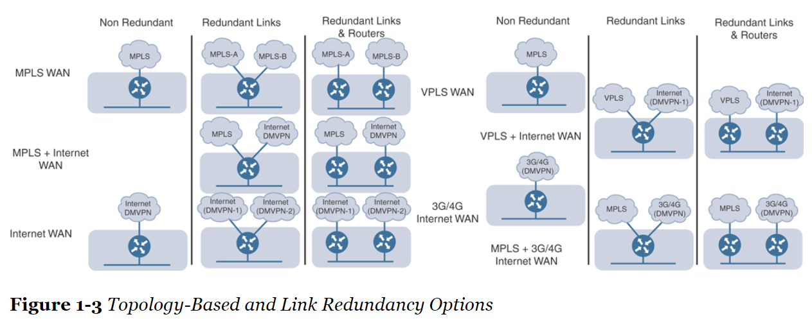
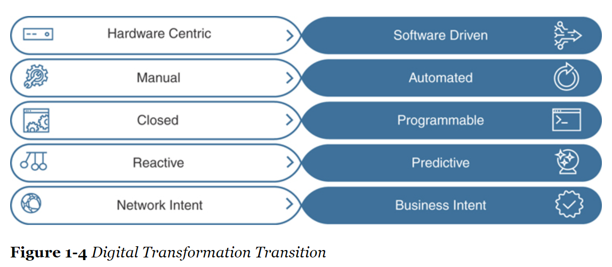
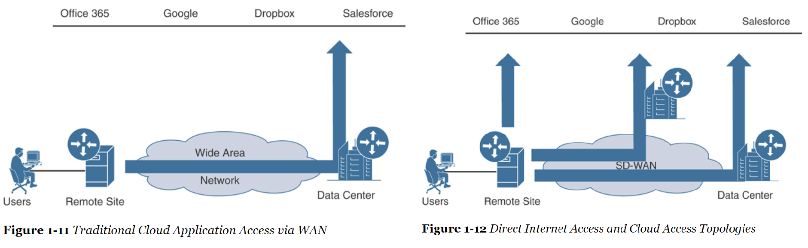
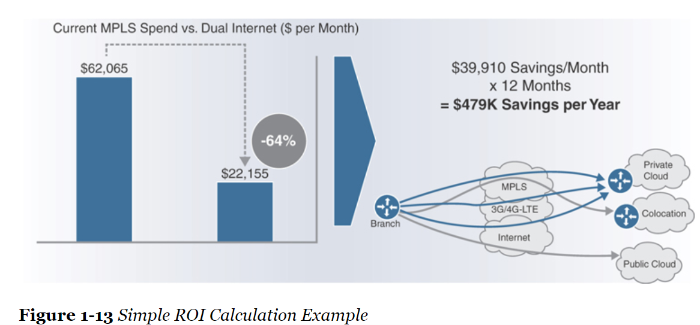

## Networks of today

- New technologies: AI, ML, Cloud Services, Virtualization, IoT are putting strain on the IT operation staff.
- These technologies offer:
  - Automation
  - Improving overal user experience within environment
  - Simplify operations of the network
- Risks associated with manually configuring Networks:
  - not being able to move fast enough when deploying new applications or Services
  - Misconfigurations
  - not being able to keep up with the scalability demand
- Analogy: Automobile as a System
- Over 30 years, thinking of a network as a collection of devices: routers, SWs, wireless components.
- Shift: Network as a holistic system
  - SDN and controllers offer the ability to manage network as a system
  - policy management can be automated and abstracted

## Common Business and IT trend

- Enterprises have different requirements: high bandwidth, real-time and big data applications
- A surge in bring-your-own-device (BYOD), cloud and dynamic business-to-business (B2B) ecosystems
- Huge increase in the use of Software as a Service (SaaS) and Infrastructure as a Service (IaaS)
  - Microsoft Office 365, Google Apps, etc.
- Common trends being seen in the industry:
  - Applications are moving to the cloud (private and public)
  - Internet edge is moving to the remote branch sites
  - Mobile devices (BYOD and guest access)
  - High-bandwidth applications
  - IoT devices
- Solutions: Offloading certain types of traffic and active/active WAN deployment models

## Common Desired Benefits

- Benefits:
  - Prioritize and secure traffic with granular control
  - Reduce costs and lower operational complexity
  - Augment or replace premium WAN bandwidth
  - Provide a consistent, high-quality user experience
  - Offload guest and public cloud traffic
  - Ensure remote site uptime
- Providing the following business outcomes and use cases:
  - Faster branch deployment with no operational interaction
  - Complete end-to-end network segmentation for enhanced security and privacy
  - Increased WAN performance
  - Topology independence
  - Better user experience

## High-Level Designed Considerations

- Various topologies and redundancy types

- Some other aspects that cause complexity within network: securing the network, leveraging network segmentation (to keep traffic types separate), implementing QoS.
- Intent-based Networking (IBN): signifying the intent of the business and automatically translating that intent into the appropriate corresponding networking tasks.
- Digital Transformation Transition

## Introduction to Cisco SD-WAN

- Hybrid WAN:
  - Additional non-MPLS commodity links (Internet, L2VPN, wireless, 4G/LTE) are added to the WAN to provide alternative paths.
  - provides transport independence.
  - some applications can be sent over these commodity links versus the service provider-controlled L3VPN MPLS links.
  - WAN connectivity is based on the network topology and managed using a peer-to-peer model. Routing (OSPF, BGP) and security (IPsec) control planes
  run independently of each other. When a configuration change is required, it has to be provisioned and propagated across all the control plane peers.

- Transport independence:
  - Cisco SD-WAN leverages a transport-independent fabric topology that is used to connect remote locations together.
    - using overlay technology to tunnel traffic over any kind of transport btw any destination.
    - able to connect remote branches that use MPLS to remote branches that use Internet.
    - give true flexibility to routing applications across any portion of the network.
  - Benefits: 
    - reduces application latency
    - simplifies network operations
    - provides seamless mobility
    - allows for the use of flexible, low-cost commodity circuits

## Use cases demanding Changes in the WAN

- Bandwidth Aggregation and Application Load-Balancing
  - The ability to use both public and private transports together at the same time, A + A or Active/Active Scenario.
  - Various Application Load Balancing Options: 

- Protecting Critical Applications with SLAs
  - Route traffic based on the application requirements
  - Provide statistics on how the applications are performing
    - SLA determines if the application is adhering to the policy
    - If not, route to another transport that fulfils the SLA

- End-to-End Segmetation
  - Different departments require separation: Research and Development versus Production environment.

- Direct Internet Access (DIA)
  - gives branches the capability to send traffic directly out of the local Internet transport instead of carrying it all the way back to a centralized data center to be inspected.
  - allows for cloud-based applications to go directly to the Internet and cloud service providers without wasting WAN bandwidth.

- Fully Managed Network Solution
  - allows third party, Cisco or Cisco Partner, manage the network as a fully managed solution.
  - provides the flexibility to control the network as a whole: control over the policy.
  - moving to an OpEx model versus CapEx model; pay for their network on a subscription basis.

## Building an ROI to Identify Cost Savings

- Return on Investment (ROI) model
  - 64% cost saving from moving from dual MPLS link design to a dual commodity Internet link design.

## Introduction to Multidomain

- With guest users, BYOD, IoT, data is generated in a distributed manner: shifting from data centers to multiple centers of data.
- Challenges: 
  - Simple, secure, and highly available connectivity 
  - Seamless policy across multiple centers of data
- Multidomain benefits:
  - the common policy will provide consistency and deterministic behavior across multiple domains
  - provide end-to-end policy management across all three domains
  - leveraging application SLAs from the data center to the WAN and back

## Cloud Trend 
