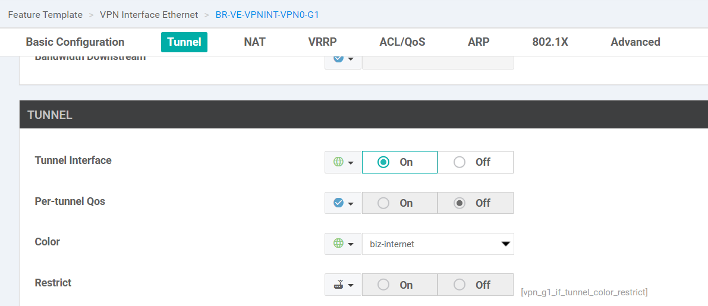
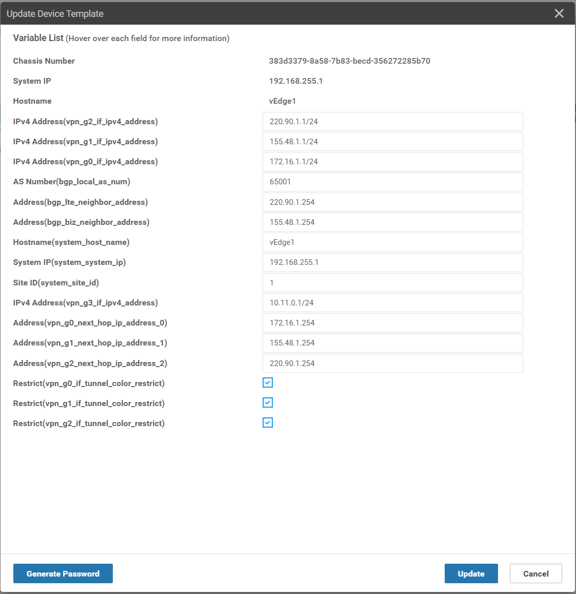
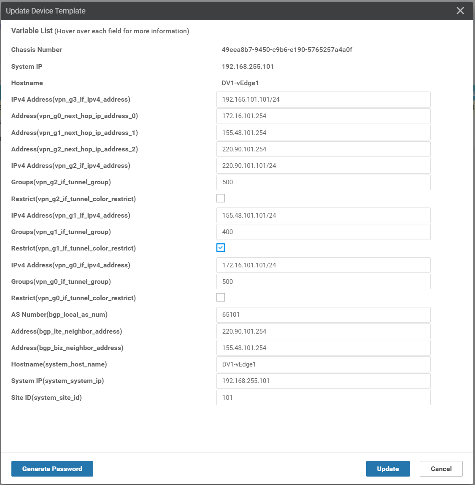

# Control Plane Operations

- vSmart is responsible for control plane functionality and facilitates Overlay Management Protocol (OMP) for building
the control plane.
- Control plane tunnels are encrypted and authenticated via Datagram Transport Layer Security (DTLS) or Transport
Layer Security (TLS).
- By default, DTLS is used over UDP port 12346.
  - vSmart and vManage use core-to-port mappings to distribute control connection load accross the CPU.

    | Core   	| UDP Port 	|
    |--------	|----------	|
    | Core 0 	| 12346    	|
    | Core 1 	| 12446    	|
    | Core 2 	| 12546    	|
    | Core 3 	| 12646    	|
    | Core 4 	| 12746    	|
    | Core 5 	| 12846    	|
    | Core 6 	| 12946    	|
    | Core 7 	| 13046    	|
  - Some common protocols can be used inside the tunnel are OMP, SNMP, and Netconf.

## Overlay Management Protocol
OMP is used to facilitates building the control plane and provides the following services:
- Facilitates network communication, including data plane connectivity among sites, service chaining, and multi-VPN
topology information.
- Advertises services available to the fabric.
- Distributes data plane security information: encryption keys.
- Best-path selection and routing policy advertisement.

OMP is enabled by default. OMP can interacts with all routing protocols including static routes, OSPF, BGP, EIGRP.
OMP operates very similarly to a BGP route reflector in an iBGP domain (Peering only between WAN Edges and vSmart).

OMP supports graceful restart. 
- When the connection to vSmart fails, WAN Edge routers continue to use the cached routing information with a default timer of 12 hours.
- This timer can be set between 1 second and 7 days.
- Recommend to set IPsec rekey timer to be twice the gracefull restart timer.

OMP advertises three types or routes: OMP routes, TLOC routes, service routes.

### OMP routes

OMP can advertise connected, static routes, and redistributed routes from OSPF, EIGRP, BGP to the vSmart controllers.
Along with reachability information, the following attributes are also adveritsed:
- TLOC: is the combination of
  - System IP address: used to identify the WAN edge that originally advertised the route.
  - Color: used to mark a WAN transport connection.
  - Encapsulation Type: GRE or IPsec.
- Origin: source of the route, with origin-proto and origin-metric, is used in best-path selection.
- Originator: identifies where the route was originally learned from, the system IP of the advertiser.
- Preference: OMP preference, can be modified to influence the best-path selection, a higher perference is preffered.
- Service: Cisco SD-WAN supports service insertion, firewall.
- Site ID: similar to BGP ASN
- Tag: optional, transitie attribute, redistributing to or from OMP does not carry the tag.
- VPN: indicates what VPN/VRF this route was advertised from

An example of OMP routes is as follow:
```bash
vEdge1# sh omp routes 10.12.0.0/24

---------------------------------------------------
omp route entries for vpn 1 route 10.12.0.0/24
---------------------------------------------------
            RECEIVED FROM:                   
peer            192.168.255.112
path-id         1
label           1003
status          C,I,R
loss-reason     not set
lost-to-peer    not set
lost-to-path-id not set
    Attributes:
     originator       192.168.255.2
     type             installed
     tloc             192.168.255.2, biz-internet, ipsec
     ultimate-tloc    not set
     domain-id        not set
     overlay-id        1
     site-id          2
     preference       not set
     tag              not set
     origin-proto     connected
     origin-metric    0
     as-path          not set
     community        not set
     unknown-attr-len not set
```

**Note that**: 
- `C, I, R` stands for "chosen, installed, resolved".
- OMP uses an administrative distance of 250 on Viptela OS routes, 251 on XE SD-WAN routes.

### TLOC routes

TLOC (Transport Location Identifier) routes identify the physical location of this device on that transport. TLOC is 
routable to the underlay and is the endpoint of the data plane tunnel.

TLOC = system IP + color + encapsulation type.

There are 22 predefined colors.

A TLOC route advertises the following information:
- TLOC private address: private IP address derived from the physical interface of the WAN Edge.
- TLOC public address: contains the publicly routable IP address assigned to the WAN Edge. If TLOC private and public
are identical, then the device is not be behind a NAT.
- Color: mark the WAN transport connection
- Encapsulation type: GRE or IPsec
- Preference: similar to OMP preference, this attribute allows to prefer one TLOC over another TLOC, a higher 
Preference value is preffered.
- Site ID: identifies the originator of this TLOC route.
- Tag: similar to route tags and OMP tags.
- Weight: used for path selection, similar to BGP Weight and is locally significant.


An example of TLOC route is as follow:

```bash
vEdge1# show omp tlocs detail 

---------------------------------------------------
tloc entries for 192.168.255.2
                 biz-internet
                 ipsec
---------------------------------------------------
            RECEIVED FROM:                   
peer            192.168.255.112
status          C,I,R
loss-reason     not set
lost-to-peer    not set
lost-to-path-id not set
    Attributes:
     attribute-type    installed
     encap-key         not set
     encap-proto       0
     encap-spi         256
     encap-auth        sha1-hmac,ah-sha1-hmac
     encap-encrypt     aes256
     public-ip         155.48.2.2
     public-port       12346
     private-ip        155.48.2.2
     private-port      12346
     public-ip         ::
     public-port       0
     private-ip        ::
     private-port      0
     bfd-status        up
     domain-id         not set
     site-id           2
     overlay-id        not set
     preference        0
     tag               not set
     stale             not set
     weight            1
     version           3
    gen-id             0x80000009
     carrier           default
     restrict          0
     on-demand          0
     groups            [ 0 ]
     bandwidth         0
     qos-group         default-group
     border             not set
     unknown-attr-len  not set
```

### Service Routes

Service Routes advertise a specific service to the rest of the overlay and can be used for Service Chaining. Note
that the Devices that provide services for the overlay must be Layer 2 adjacent.

To enable the Service Chaining, the workflow:
- Defines the service via feature template.
- WAN Edge routers advertise services to vSmart, also their OMP and TLOC routes.
- Applies a policy defining traffic must flow through these advertised services.

The service routes contain the following information:
- VPN ID: what VPN this service applies to.
- Service ID: defines service types: FW (svc-id 1), IDS (svc-id 2), IDP (svc-id 3), netsvc1, 2, 3, 4.
- Label:
- Orginator ID: system IP of the node advertising the service.
- TLOC: where the service is located.
- Path ID: identifies the OMP path.

### Path Selection

1. Valid OMP route
2. Locally sourced OMP route
3. Lower administrative distance
4. Higher OMP Preference
5. Higher TLOC Preference
6. Higher Origin: compare the origin type in the following order (first match wins): connected, static, eBGP,
EIGRP internal, OSPF intra-area, OSPF inter-area, OSPF external, EIGRP external, iBGP, Unknown.
7. Lowest Origin metric
8. Highest System IP
9. Highest TLOC private address

vSmart can advertise up to 16 equal-cost routes. By default, advertise 4 equal-cost routes.

### OMP Route Redistribution and Loop Prevention

By default, OMP will automatically redistribute Connected, Static, OSPF intra-area, OSPF inter-area. Redistribution
of BGP, EIGRP, and OSPF external must be explicitly configured.

Rooting Loop occurs when two or more routers have mutual redistribution from the WAN and the LAN routing protocols.
- OSPF Loop prevention with Down Bit: When a route is redistributed from OMP to OSPF, WAN Edge sets Down bit, then
this LSA moves across the network and gets to other WAN Edge and will be dropped.
- BGP Loop Prevention with Site of Origin (SoO): When the other WAN Edge receives BGP update from core network, 
the BGP update with the SoO matches its own site ID will be dropped.
- EIGRP Loop prevention with External Protocol Field: when redistributing from OMP into EIGRP, External Protocol is
set to **OMP-Agent**. When other WAN Edge receives, it sets "SD-WAN-Down" bit and its AD to 252.

# Data Plane Operations
## TLOC colors
There are private and public colors.
- Public colors: 3g, biz-internet, public-internet, lte, blue, bronze, custom1, custom2, custom3, gold, green,
red, silver. Use when there is a NAT between WAN Edge devices
- Private colors: metro-ethernet, mpls, private1 to private6. Only use when there is no NAT between devices (overlay).

When establishing the IPsec data plane, a fush mesh connectivity between all routers in the fabric is established by
default. 

Consider vEdge1 with 3 colors: mpls, biz-internet, lte:
```bash
vEdge1# show omp tlocs advertised | b ADD
ADDRESS                                           
FAMILY   TLOC IP          COLOR            ENCAP  
--------------------------------------------------
ipv4     192.168.255.1    mpls             ipsec  
         192.168.255.1    biz-internet     ipsec  
         192.168.255.1    lte              ipsec  
```

Consider vEdge2 with 3 colors: mpls, biz-internet, lte:
```bash
vEdge2# show omp tlocs advertised | b ADD
ADDRESS                                           
FAMILY   TLOC IP          COLOR            ENCAP  
--------------------------------------------------
ipv4     192.168.255.2    mpls             ipsec  
         192.168.255.2    biz-internet     ipsec  
         192.168.255.2    lte              ipsec  
```

Let's see the BFD connections between vEdge1 (3 colors: mpls, biz-internet, lte) and vEdge2 (3 colors: mpls,
biz-internet, lte). Each vEdge has three colors, so with full-mesh connectivity we have 3*3 = 9 BFD connections.

```bash
vEdge1# show bfd sessions 
                                      SOURCE TLOC      REMOTE TLOC                                      DST PUBLIC                      DST PUBLIC         DETECT      TX                              
SYSTEM IP        SITE ID  STATE       COLOR            COLOR            SOURCE IP                       IP                              PORT        ENCAP  MULTIPLIER  INTERVAL(msec) UPTIME          TRANSITIONS 
-------------------------------------------------------------------------------------------------------------------------------------------------------------------------------------------------------------
192.168.255.2    2        up          biz-internet     biz-internet     155.48.1.1                      155.48.2.2                      12346       ipsec  7           1000           0:00:38:06      0           
192.168.255.2    2        up          biz-internet     mpls             155.48.1.1                      172.16.2.2                      12426       ipsec  7           1000           0:00:01:00      0           
192.168.255.2    2        up          biz-internet     lte              155.48.1.1                      220.90.2.2                      12426       ipsec  7           1000           0:00:01:00      0           
192.168.255.2    2        up          mpls             biz-internet     172.16.1.1                      155.48.2.2                      12346       ipsec  7           1000           0:00:00:58      0           
192.168.255.2    2        up          mpls             mpls             172.16.1.1                      172.16.2.2                      12426       ipsec  7           1000           0:00:00:58      0           
192.168.255.2    2        up          mpls             lte              172.16.1.1                      220.90.2.2                      12426       ipsec  7           1000           0:00:00:58      0           
192.168.255.2    2        up          lte              biz-internet     220.90.1.1                      155.48.2.2                      12346       ipsec  7           1000           0:00:00:58      0           
192.168.255.2    2        up          lte              mpls             220.90.1.1                      172.16.2.2                      12426       ipsec  7           1000           0:00:00:58      0           
192.168.255.2    2        up          lte              lte              220.90.1.1                      220.90.2.2                      12426       ipsec  7           1000           0:00:00:58      0      
```


To control the data plane connectivity (BFD connections), we can set the `restrict` attribute or configure tunnel
groups.
### Restrict Attribute
The restrict attribute needs to be defined per site and can be 1 or 0. 
- restrict = 1: this device will only form the tunnels with other TLOCs advertising the color
- retrict = 0: can form tunnels with other colors

To set the `restrict` attribute of a color, we have to configure the VPN Interface associated with this color. For
example:
- configure `BR-VE-VPNINT-VPN0-G0` to set the `restrict` attribute for `mpls` color.
- configure `BR-VE-VPNINT-VPN0-G1` to set the `restrict` attribute for `biz-internet` color.
- configure `BR-VE-VPNINT-VPN0-G2` to set the `restrict` attribute for `lte` color.



Push the configuration to the vEdge1 and vEdge2: Check the `restrict` box



Let's see the BFD connections after setting `restrict` attribute. There are only three BFD connections: biz-internet
<- -> biz-internet, mpls <- -> mpls, and lte <- -> lte.

```bash
vEdge1# sh bfd sessions
                                      SOURCE TLOC      REMOTE TLOC                                      DST PUBLIC                      DST PUBLIC         DETECT      TX                              
SYSTEM IP        SITE ID  STATE       COLOR            COLOR            SOURCE IP                       IP                              PORT        ENCAP  MULTIPLIER  INTERVAL(msec) UPTIME          TRANSITIONS 
-------------------------------------------------------------------------------------------------------------------------------------------------------------------------------------------------------------
192.168.255.2    2        up          biz-internet     biz-internet     155.48.1.1                      155.48.2.2                      12346       ipsec  7           1000           0:01:25:28      0           
192.168.255.2    2        up          mpls             mpls             172.16.1.1                      172.16.2.2                      12426       ipsec  7           1000           0:00:48:20      0           
192.168.255.2    2        up          lte              lte              220.90.1.1                      220.90.2.2                      12426       ipsec  7           1000           0:00:48:20      0          
```

### Tunnel Groups

Only tunnels with matching tunnel groups, or no tunnel group defined, will form BFD connections. If using tunnel
groups, all sites should define tunnel groups.

Let's involve now the DC1-vEdge1 with vEdge1, vEdge2. Each WAN Edge has three colors: mpls, biz-internet, lte. We
want to restrict `biz-internet`, and set two tunnel groups:
- Group 400: biz-internet
- Group 500: mpls and lte

Configure the tunnel groups for each VPN Interface:


Push the configuration to the vEdge1, vEdge2, and DC1-vEdge1: 
- Check the `restrict` box for `biz-internet`
- Set group accordingly for mpls, lte, and biz-internet.



Let's see the BFD connections among three devices:

```bash
DV1-vEdge1# show bfd sessions 
                                      SOURCE TLOC      REMOTE TLOC                                      DST PUBLIC                      DST PUBLIC         DETECT      TX                              
SYSTEM IP        SITE ID  STATE       COLOR            COLOR            SOURCE IP                       IP                              PORT        ENCAP  MULTIPLIER  INTERVAL(msec) UPTIME          TRANSITIONS 
-------------------------------------------------------------------------------------------------------------------------------------------------------------------------------------------------------------
192.168.255.1    1        up          biz-internet     biz-internet     155.48.101.101                  155.48.1.1                      12346       ipsec  7           1000           0:00:06:57      1           
192.168.255.1    1        up          mpls             mpls             172.16.101.101                  172.16.1.1                      12406       ipsec  7           1000           0:00:06:57      1           
192.168.255.1    1        up          mpls             lte              172.16.101.101                  220.90.1.1                      12406       ipsec  7           1000           0:00:06:57      0           
192.168.255.1    1        up          lte              mpls             220.90.101.101                  172.16.1.1                      12406       ipsec  7           1000           0:00:06:57      0           
192.168.255.1    1        up          lte              lte              220.90.101.101                  220.90.1.1                      12406       ipsec  7           1000           0:00:06:57      1           
192.168.255.2    2        up          biz-internet     biz-internet     155.48.101.101                  155.48.2.2                      12346       ipsec  7           1000           0:00:10:15      1           
192.168.255.2    2        up          mpls             mpls             172.16.101.101                  172.16.2.2                      12426       ipsec  7           1000           0:00:19:30      0           
192.168.255.2    2        up          mpls             lte              172.16.101.101                  220.90.2.2                      12426       ipsec  7           1000           0:00:10:15      0           
192.168.255.2    2        up          lte              mpls             220.90.101.101                  172.16.2.2                      12426       ipsec  7           1000           0:00:10:14      0           
192.168.255.2    2        up          lte              lte              220.90.101.101                  220.90.2.2                      12426       ipsec  7           1000           0:00:19:28      0      


vEdge1# show bfd sessions
                                      SOURCE TLOC      REMOTE TLOC                                      DST PUBLIC                      DST PUBLIC         DETECT      TX                              
SYSTEM IP        SITE ID  STATE       COLOR            COLOR            SOURCE IP                       IP                              PORT        ENCAP  MULTIPLIER  INTERVAL(msec) UPTIME          TRANSITIONS 
-------------------------------------------------------------------------------------------------------------------------------------------------------------------------------------------------------------
192.168.255.2    2        up          biz-internet     biz-internet     155.48.1.1                      155.48.2.2                      12346       ipsec  7           1000           0:00:00:17      1           
192.168.255.2    2        up          mpls             mpls             172.16.1.1                      172.16.2.2                      12426       ipsec  7           1000           0:00:00:17      1           
192.168.255.2    2        up          mpls             lte              172.16.1.1                      220.90.2.2                      12426       ipsec  7           1000           0:00:00:17      2           
192.168.255.2    2        up          lte              mpls             220.90.1.1                      172.16.2.2                      12426       ipsec  7           1000           0:00:00:17      0           
192.168.255.2    2        up          lte              lte              220.90.1.1                      220.90.2.2                      12426       ipsec  7           1000           0:00:00:17      1           
192.168.255.101  101      up          biz-internet     biz-internet     155.48.1.1                      155.48.101.101                  12366       ipsec  7           1000           0:00:00:17      1           
192.168.255.101  101      up          mpls             mpls             172.16.1.1                      172.16.101.101                  12366       ipsec  7           1000           0:00:00:17      1           
192.168.255.101  101      up          mpls             lte              172.16.1.1                      220.90.101.101                  12366       ipsec  7           1000           0:00:00:17      0           
192.168.255.101  101      up          lte              mpls             220.90.1.1                      172.16.101.101                  12366       ipsec  7           1000           0:00:00:17      0           
192.168.255.101  101      up          lte              lte              220.90.1.1                      220.90.101.101                  12366       ipsec  7           1000           0:00:00:17      1           


vEdge2# show bfd sessions 
                                      SOURCE TLOC      REMOTE TLOC                                      DST PUBLIC                      DST PUBLIC         DETECT      TX                              
SYSTEM IP        SITE ID  STATE       COLOR            COLOR            SOURCE IP                       IP                              PORT        ENCAP  MULTIPLIER  INTERVAL(msec) UPTIME          TRANSITIONS 
-------------------------------------------------------------------------------------------------------------------------------------------------------------------------------------------------------------
192.168.255.1    1        up          biz-internet     biz-internet     155.48.2.2                      155.48.1.1                      12346       ipsec  7           1000           0:00:08:06      1           
192.168.255.1    1        up          mpls             mpls             172.16.2.2                      172.16.1.1                      12406       ipsec  7           1000           0:00:08:06      1           
192.168.255.1    1        up          mpls             lte              172.16.2.2                      220.90.1.1                      12406       ipsec  7           1000           0:00:08:06      2           
192.168.255.1    1        up          lte              mpls             220.90.2.2                      172.16.1.1                      12406       ipsec  7           1000           0:00:08:06      0           
192.168.255.1    1        up          lte              lte              220.90.2.2                      220.90.1.1                      12406       ipsec  7           1000           0:00:08:06      1           
192.168.255.101  101      up          biz-internet     biz-internet     155.48.2.2                      155.48.101.101                  12366       ipsec  7           1000           0:00:11:25      1           
192.168.255.101  101      up          mpls             mpls             172.16.2.2                      172.16.101.101                  12366       ipsec  7           1000           0:00:20:40      0           
192.168.255.101  101      up          mpls             lte              172.16.2.2                      220.90.101.101                  12366       ipsec  7           1000           0:00:11:25      0           
192.168.255.101  101      up          lte              mpls             220.90.2.2                      172.16.101.101                  12366       ipsec  7           1000           0:00:11:24      0           
192.168.255.101  101      up          lte              lte              220.90.2.2                      220.90.101.101                  12366       ipsec  7           1000           0:00:20:39      0           

```

## Network Address Translation
### NAT types

There are various types of NAT deployments.
- Full Cone NAT: one-to-one or static NAT, can have multiple full cone NATs using the same public IP, but the internal
ports must be different per internal host. External and internal ports don't need to match.
- Symmetric NAT: dynamic PAT: the original source IP will be translated to the outside IP address, and the source port
will be translated to another port (up to 63335 hosts behind a single public IP).
- Addressed Restricted Cone NAT: similar to full cone NAT, except only allows external hosts to communicate to internal
host if that host has communicated with the external host before on any port.
- Port Restricted Cone NAT: similar to address restricted cone NAT, except it uses port number as a filter.

### Cisco SD-WAN solution

When the WAN Edge initially connects to vBond, it learns about other components in the fabric and also if it is behind
a NAT device or not using STUN (RFC 5389) mechanism. An example is as follows:
1. STUN Request: Original SRC IP is 192.168.1.2
2. Firewall translates SRC IP to 209.165.201.1
3. vBond receives STUN request 
4. vBond responds with STUN response contains translated IP.
5. Firewall receives packets and translates destination IP to 192.168.1.2
6. WAN Edge receives packets with different IP in STUN Response, it knows it's behind a NAT.

Symmetric NAT can cause issues for data plane connectivity.
- If both WAN Edges are behind symmetric NAT, the data plane connectivity will be failed.
- Required at least one fof the WAN Edges not use symmetric NAT.

### Network Segmentation

Network Segmantation is accomplished via VPNs. There are three different types of VPNs:
- Service VPN: LAN side of the routers (service side), VPN 1 to 511.
- Transport VPN: WAN side of the routers, VPN0.
- Management VPN: out-of-band management interface, VPN 512.

Each data packet will carry a VPN ID that identifies the VPN it belongs to on the overlay.

## Data Plane Encryption

Cisco SD-WAN supports:
- Authentication: 2048-bit RSA encryption, Encapsulation Security Payload (ESP), and Authentication Header (AH).
- Encryption: AES with 256-bit key length.
- Integrity: Hashing mechanism with Galois Counter Mode (GCM) of AES-256; and Anti-Replay Protection.

Cisco SD-WAN implements key exhange, negotiations within control plane that eliminates the need for Internet Key
Exchange (IKE) protocol.
- Each WAN Edge generates an encryption key with AES-256.
- Each WAN Edge advertises the key via an OMP route update. vSmart receives and reflects the key to the rest of the
network.
- All WAN Edges have their respective peer keys.

By default, the key exchange between WAN Edges and vSmart uses symmetric keys in an asymetric fashion.
- When WAN Edge 1 sends data to WAN Edge 2, it encrypts data using WAN Edge 2's key and WAN Edge 2 uses its key for 
decryption.
- The same, when WAN Edge 2 sends data to WAN Edge 1, it encrypts data using WAN Edge 1's key.

### Data Plane Encryption with Pairwise

The same key isn't used across all devices in the fabric for encryption and decryption. With pairwise, the unique
key pairs are used between two WAN Edges. Pairwise is disable by default, can be configured via templates.

Consider we have WAN Edge A, B, and C. 
- Each WAN Edge generates a key for each transport and each peer. This key will be advertised via OMP to vSmart.
- For communication between A and B: A will use key AB to encrypt data, B will use key BA to encrypt data.
- For communication between A and C: A will use key AC to encrypt data, C will use key CA to encrypt data.

Overhead Issues: Cisco SD-WAN use Path MTU (Maximum Transmission Unit) discovery mechanism via BFD protocol to probe 
the tunnel to determine the maximum packet size. By default, the tunnel is checked every minute.