When learning about a new technology:
- Khawar Butt: "see it, touch it to believe it".
- Judson's friend : "build it, break it, fix it to learn it".

Then build a lab from the [SD-WAN book](https://www.ciscopress.com/store/cisco-software-defined-wide-area-networks-designing-9780136533177) to learn based on practicing with the lab.

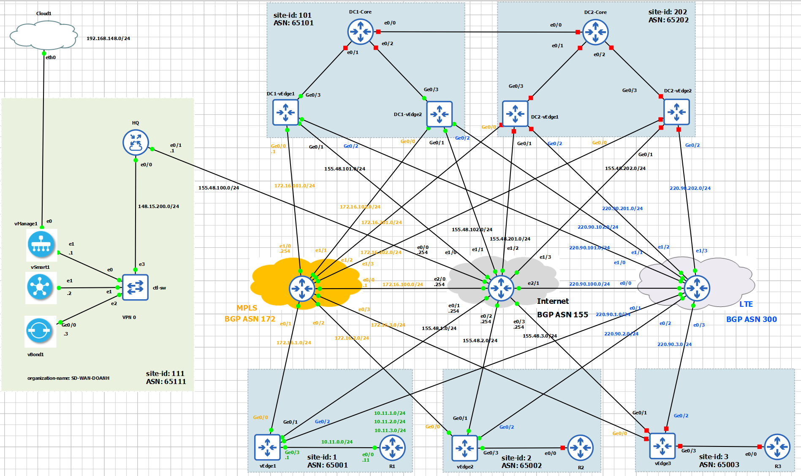

Our purpose is to build the device template for configuration of `vEdge1`. Let's take a close look at `vEdge1`.

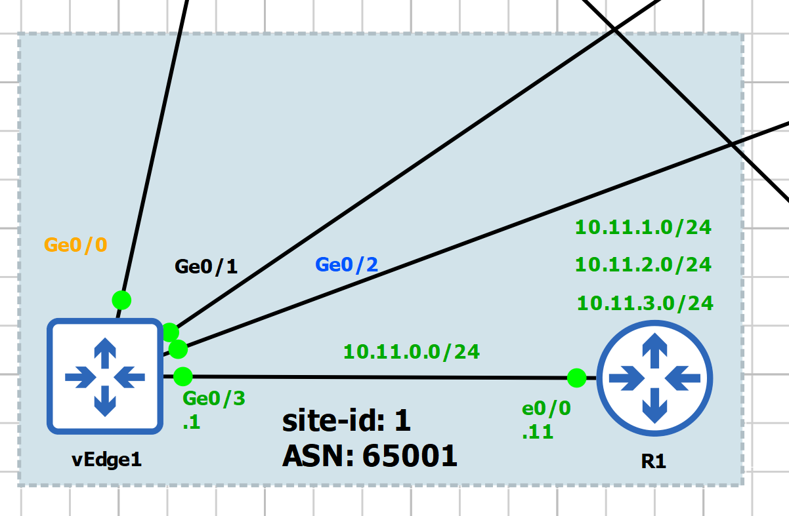

What we need for vEdge1:
- Transport VPN: VPN0, configuration for `Ge0/0`, `Ge0/1`, `Ge0/2`
- Service VPN: VPN1, configuration for `Ge0/3`
- Management VPN: VPN512, configuration for `eth0`
- BGP neighbor with Internet via `Ge0/1` and BGP neighbor with LTE via 'Ge0/2'

Let's start building piece-by-piece the neccessary feature templates:
- Create system template
- Create banner template (optional)
- Create VPN templates: VPN0, VPN1, VPN512
- Create VPN Interface templates: VPNINT-VPN0-G0, G1, G2; VPNINT-VPN1-G3, VPNINT-VPN512-E0
- Create BGP template

# 1. Create Feature Template
Before starting create template, it is very important to plan the template name properly. We need to come up with
 a meaningful way to name the template that is suitable for the intent use of the template. For example, let's us
 consider the following naming convention: 
  - System template for vEdge Cloud at a Branch: BR-VE-SYSTEM
  - VPN template for vEdge Cloud at a Branch: BR-VE-VPN-VPN0

When we create a template, for each parameter we have three types of settings as follows:
- Global: Apply to all devices using this template, will not be asked for this parameter when the template is attached to a device.
- Device specific: when apply template, we will need to specify this parameter.
- Default:


## 1.1. Create System Template

- Template Name: BR-VE-SYSTEM
- Site ID: Device Specific
- System IP:  Device Specific
- Hostname: Device Specific
- Timezone: Global: Europe/London
- Console Baud Rate: Default

We create the first `BR-VE-SYSTEM` template as in the following figure.
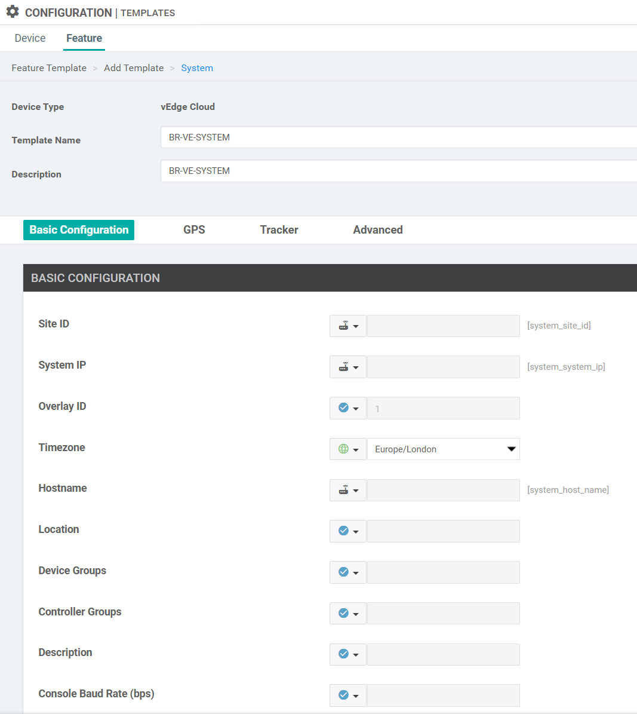

### 1.2. Create Banner Template (Optional)
- Template name: VE-banner
- Description: VE-banner
- Login banner: Global "This is vEdge Cloud Login banner"
- MOTD banner: Global "This is vEdge Cloud MOTD banner"

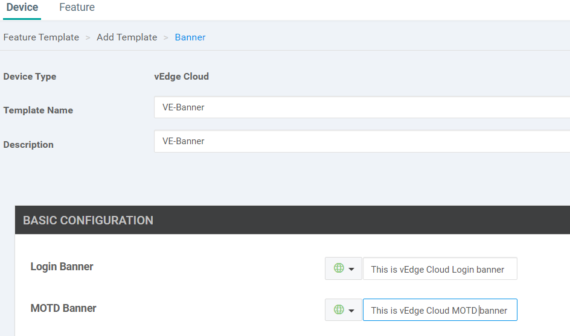

## 1.3. Create VPN Templates
### Create VPN0 Template

- Template Name: BR-VE-VPN-VPN0
- Description: BR-VE-VPN-VPN0
- Basic configuration: 
  - VPN: Global: 0
  - Name: Global: Transport VPN

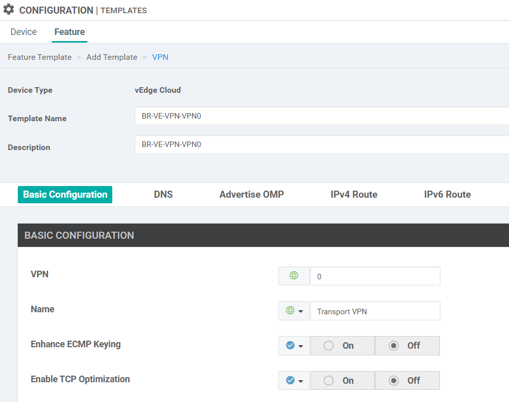

- IPv4 Route Configuration:
  - Prefix: Global: Default
  - Next Hop: Device Specific
    - Key Value: vpn0_next_hop_ip_address_0

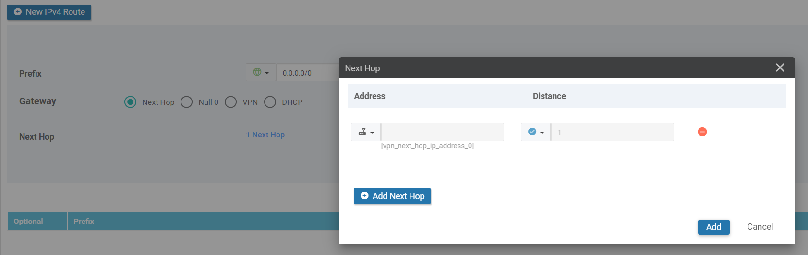


### Create VPN1 Template

- Template Name: BR-VE-VPN-VPN1
- Description: BR-VE-VPN-VPN1
- Basic configuration: 
  - VPN: Global: 1
  - Name: Global: Service VPN


### Create VPN512 Template
- Template Name: BR-VE-VPN-VPN512
- Description: BR-VE-VPN-VPN512
- Basic configuration: 
  - VPN: Global: 512
  - Name: Global: Management VPN


## 1.4. Create VPN Interface Ethernet Templates
### Create BR-VE-VPNINT-VPN0-G0
- Template Name: BR-VE-VPNINT-VPN0-G0
- Description: BR-VE-VPNINT-VPN0-G0
- Basic Configuration
  - Shutdown: Global: No
  - Interface Name: Global: ge0/0
  - Description: Global: Transport MPLS
- IPv4 Address: 
  - Static: Device Specific
  - Key Value: vpn_g0_if_ipv4_address

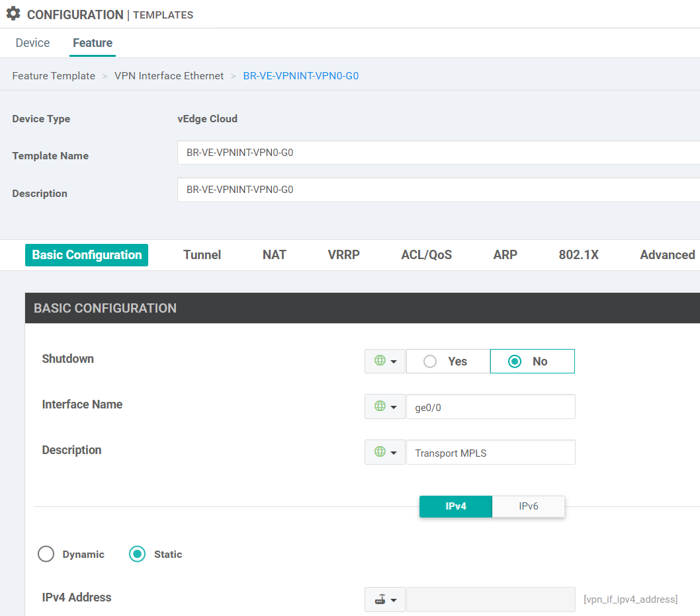

- Tunnel 
  - Tunnel Interface: Global: On
  - Color: Global: mpls
- Allow Service
  - All: Global: On
  - NETCONF: Global: On
  - SSH: Global: On

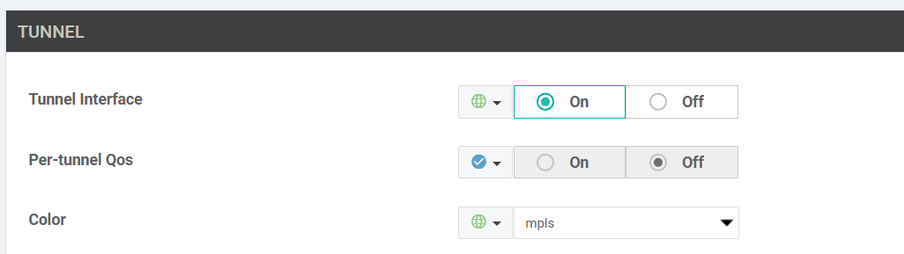

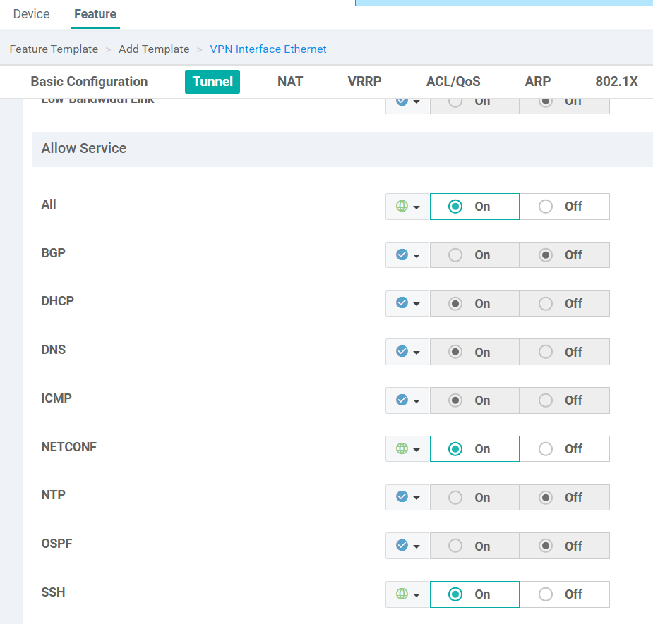

### Create BR-VE-VPNINT-VPN0-G1
Copy from BR-VE-VPNINT-VPN0-G0, only change the following fields:
- Interface name: 'ge0/1'
- Description: `Transport Internet`
- Select color as `biz-internet`

### Create BR-VE-VPNINT-VPN0-G2
Copy from BR-VE-VPNINT-VPN0-G0, only change the following fields:
- Interface name: 'ge0/2'
- Description: `Transport LTE`
- Select color as `lte`

### Create BR-VE-VPNINT-VPN1-G3
- Template Name: BR-VE-VPNINT-VPN1-G3
- Description: BR-VE-VPNINT-VPN1-G3
- Basic Configuration
  - Shutdown: Global: No
  - Interface Name: Global: ge0/3
  - Description: Global: Service VPN1 Interface
- IPv4 Address: 
  - Static: Device Specific
  - Key Value: vpn_g3_if_ipv4_address

### Create BR-VE-VPNINT-VPN512-ETH0
- Template name: BR-VE-VPNINT-VPN512-ETH0
- Description: BR-VE-VPNINT-VPN512-ETH0
- Interface name: Global eth0
- IPv4: Dynamic

## 1.5. Create Routing Feature Templates

### Create OSPF Template
- Template name: BR-VE-OSPF-VPN0
- Description: BR-VE-OSPF-VPN0
- Router ID: Default
- Area number: Global: 0
- Add interface: 
  - Interface name: Global ge0/0
  - Advanced options: OSPF network type: Global point-to-point

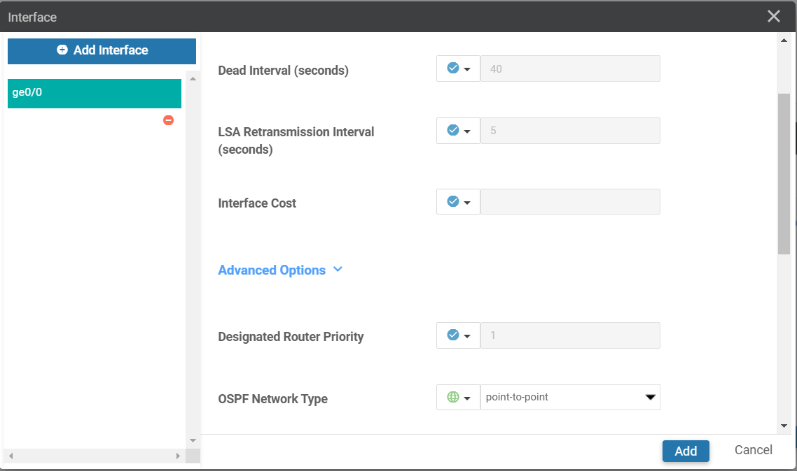

### Create BGP Template
**BR-VE-BGP-VPN0**
- Template Name: BR-VE-BGP-VPN0
- Basic Configuration
  - Shutdown: Global: No
  - AS Number: Device Specific
    - Key Value: bgp_local_as_num
- Adding Neighbor to LTE transport
  - Address: Device Specific
  - Key Value: bgp_lte_neighbor_address
  - Remote AS: Global: 300
  - Address Family: Global: On
  - Address Family: Global: IPv4-Unicast
- Adding Neighbor to biz-internet transport
  - Address: Device Specific
  - Key Value: bgp_biz_neighbor_address
  - Remote AS: Global: 155
  - Address Family: Global: On
  - Address Family: Global: IPv4-Unicast

# 2. Create Device Template
## 2.1. BR-VE-DEV-TEMP

- Template Name: BR-VE-DEV-TEMP
- Description: BR-VE-DEV-TEMP
- Basic Information
  - System: BR-VE-SYSTEM

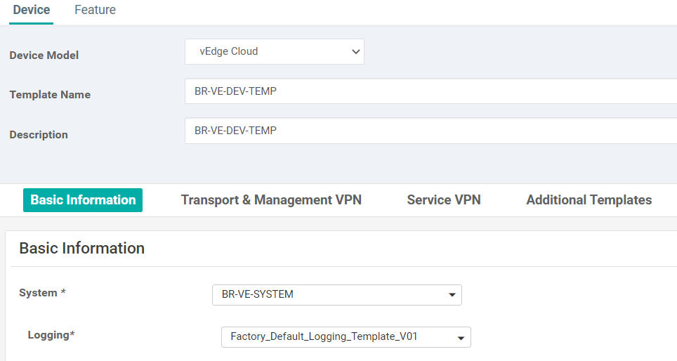

- Transport and Management VPN
  - VPN 0: BR-VE-VPN-VPN0
    - BGP: BR-VE-BGP-VPN0
    - OSPF: BR-VE-OSPF-VPN0
    - VPN Interface:
      - BR-VE-VPNINT-VPN0-G0
      - BR-VE-VPNINT-VPN0-G1
      - BR-VE-VPNINT-VPN0-G2
  - VPN 512: BR-VE-VPN-VPN512
    - VPN Interface:
      - BR-VE-VPNINT-VPN512-ETH0
- Service VPN
  - VPN 1: BR-VE-VPN-VPN1
    - VPN Interface: BR-VE-VPNINT-VPN1-G3


- Additional Templates:
  - Banner: VE-Banner

## 2.2. Attach device template to WAN Edges

### Attach BR-VE-DEV-TEMP to vEdge1
- Use the addressing scheme in the topology to fill in the variables when apply the device template.

- Attach vEdge1


- Attach vEdge2

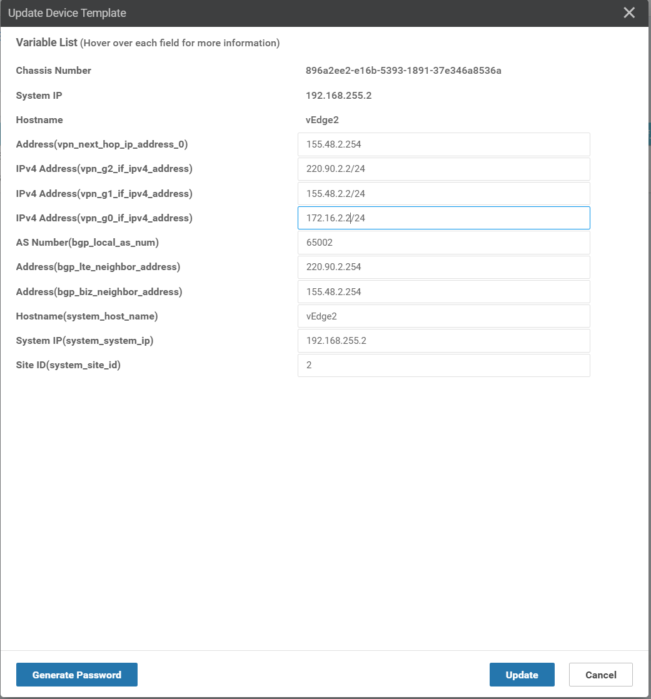

- Check the BGP configuration on `vEdge1`

```bash
vEdge1# sh bgp summary
vpn                    0
bgp-router-identifier  192.168.255.1
local-as               65001
rib-entries            49
rib-memory             5488
total-peers            2
peer-memory            9632
Local-soo              SoO:0:1
ignore-soo             
                       MSG       MSG       OUT                     PREFIX  PREFIX  PREFIX                
NEIGHBOR         AS    RCVD      SENT      Q      UPTIME           RCVD    VALID   INSTALLED  STATE      
---------------------------------------------------------------------------------------------------------
155.48.1.254     155   100       89        0      0:01:23:56       25      25      18         established
220.90.1.254     300   98        89        0      0:01:23:53       25      25      7          established
```

- Check the BGP configuration on `vEdge2`

```bash
vEdge2# sh bgp summary 
vpn                    0
bgp-router-identifier  192.168.255.2
local-as               65002
rib-entries            49
rib-memory             5488
total-peers            2
peer-memory            9632
Local-soo              SoO:0:2
ignore-soo             
                       MSG       MSG       OUT                     PREFIX  PREFIX  PREFIX                
NEIGHBOR         AS    RCVD      SENT      Q      UPTIME           RCVD    VALID   INSTALLED  STATE      
---------------------------------------------------------------------------------------------------------
155.48.2.254     155   11        10        0      0:00:06:52       25      25      18         established
220.90.2.254     300   11        12        0      0:00:06:42       25      25      7          established
```

- Check the OMP routes

```bash
vEdge1# sh omp routes 10.12.0.0/24

---------------------------------------------------
omp route entries for vpn 1 route 10.12.0.0/24
---------------------------------------------------
            RECEIVED FROM:                   
peer            192.168.255.112
path-id         1
label           1003
status          C,I,R
loss-reason     not set
lost-to-peer    not set
lost-to-path-id not set
    Attributes:
     originator       192.168.255.2
     type             installed
     tloc             192.168.255.2, biz-internet, ipsec
     ultimate-tloc    not set
     domain-id        not set
     overlay-id        1
     site-id          2
     preference       not set
     tag              not set
     origin-proto     connected
     origin-metric    0
     as-path          not set
     community        not set
     unknown-attr-len not set
```